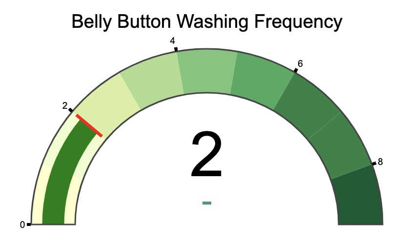

# interactive-viz-and-dashboard-challenge
This is the 15th homework for the UMN Data Analytics and Visualization Bootcamp. This homework uses HTML, javascript, and Plotly to generate visualizations of a dataset. 

## Work breakdown structure
- import data
- populate the dropdown
- generate initial charts, based on the first item in the dropdown
    - bar graph
    - bubble chart
    - demographic information
    - gauge chart
- respond to change events on dropdown to update the graphs, charts, and demographic information associated with the sample

### Challenges
The most challenging part of this project was reading the metadata from the samples to the demographic information panel. This was first done by pulling the information to an array and reading it out, but that resulted in the content not having proper breaks between lines. The instructions for the project required that it is put into the panel using key value pairs. Once that change was made, the challenge was writing a function to clear the panel to work between change eveents. 

### Lessons
This lesson helped me practice displaying data in many different chart types (bar, bubble, and guage) to make the data interactive and interesting for a user by using dropdowns and hover info on the charts. Developing the guage helped me better understand options to customize a chart to make it match a branding or color scheme. 

  

